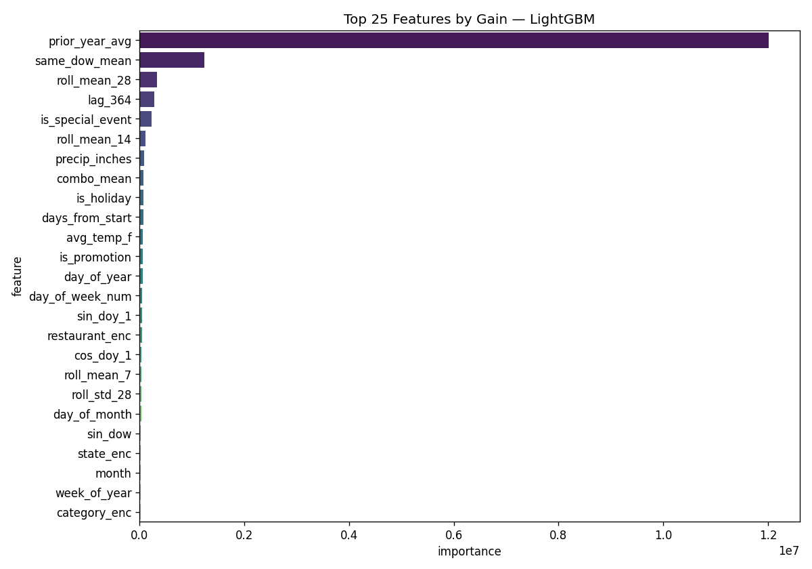
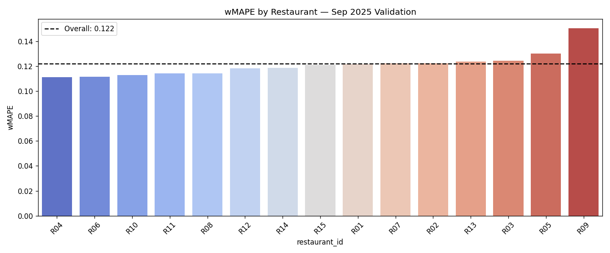
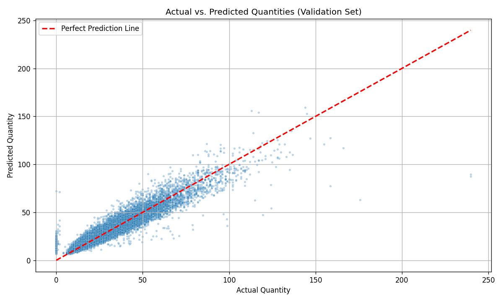
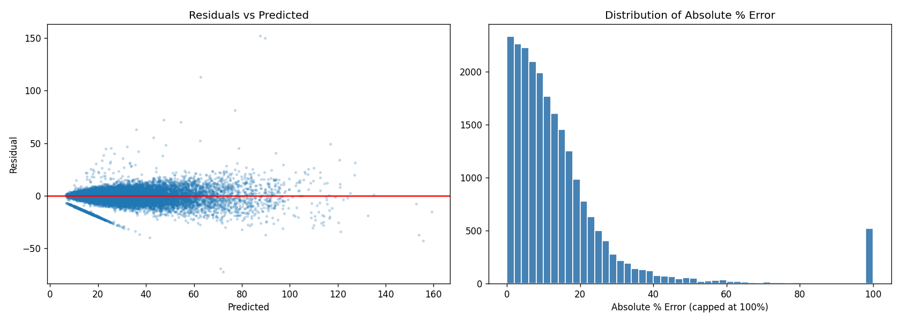

```{r}
#| label: setup
#| include: false

library(tidyverse)
library(lubridate)
library(janitor)
library(skimr)
library(scales)
library(glue)
library(ggalluvial)
library(patchwork)
```


```{r}
#| label: load-data
#| echo: false

df <- read_csv("qsr_demand_dataset.csv") |>
  filter(!is.na(quantity))
```


---

## 1. Data Overview

```{r}
#| label: data-overview

glue("Rows (after dropping 0.4% missing quantity): {format(nrow(df), big.mark = ',')}")
glue("Date range: {min(df$date)} to {max(df$date)}")
glue("Restaurants: {n_distinct(df$restaurant_id)}")
glue("Menu items:  {n_distinct(df$menu_item_id)}")
glue("Categories:  {n_distinct(df$category)}")
```


---

## 2. Missing Quantity Analysis

5,475 rows (0.40%) had no recorded quantity. This section documents the structure
of that missingness to confirm no imputation is needed.


Missing count by year:

```{r}
#| label: missing-by-year

df_full <- read_csv("qsr_demand_dataset.csv")

missing <- df_full |>
  filter(is.na(quantity))

missing |>
  count(year) |>
  arrange(year) |>
  mutate(text = paste0(year, "  ", n)) |>
  pull(text) |>
  cat(sep = "\n")
```


Missing count by restaurant (years as columns + total):

```{r}
#| label: missing-by-restaurant

missing |>
  count(restaurant_id, year) |>
  tidyr::pivot_wider(
    names_from  = year,
    values_from = n,
    values_fill = 0
  ) |>
  mutate(total = rowSums(across(-restaurant_id))) |>
  arrange(total) |>
  print(n = Inf)
```


Missing count by menu item (top 20):

```{r}
#| label: missing-by-item

missing |>
  count(menu_item_name, sort = TRUE) |>
  slice_head(n = 20) |>
  print(n = 20)
```


Unique dates with at least one missing row per restaurant:

```{r}
#| label: missing-unique-dates

missing |>
  group_by(restaurant_id) |>
  summarise(n_unique_dates = n_distinct(date), .groups = "drop") |>
  print(n = Inf)
```


How many items missing on the same restaurant-date?

```{r}
#| label: missing-clustering

missing |>
  count(restaurant_id, date, name = "items_missing") |>
  count(items_missing, sort = FALSE) |>
  arrange(items_missing) |>
  print(n = Inf)
```


```{r}
#| label: sankey-missing
#| echo: false
#| fig-width: 10
#| fig-height: 6

alluvial_data <- missing |>
  count(restaurant_id, category, name = "missing_count")

ggplot(
  alluvial_data,
  aes(
    axis1 = restaurant_id,
    axis2 = category,
    y     = missing_count
  )
) +
  geom_alluvium(aes(fill = category), width = 0.3, alpha = 0.75, knot.pos = 0.4) +
  geom_stratum(width = 0.3, fill = "grey92", color = "grey40") +
  geom_text(stat = "stratum", aes(label = after_stat(stratum)), size = 3) +
  scale_x_discrete(
    limits = c("Restaurant", "Category"),
    expand = c(0.05, 0.05)
  ) +
  scale_fill_brewer(palette = "Set2") +
  labs(
    title    = "Flow of missing quantity rows: Restaurant -> Category",
    subtitle = "Width proportional to missing row count | each band = one restaurant-category pair",
    y        = "Missing rows",
    fill     = "Category"
  ) +
  theme_minimal(base_size = 12) +
  theme(
    panel.grid      = element_blank(),
    axis.text.y     = element_blank(),
    axis.ticks      = element_blank(),
    legend.position = "right"
  )
```


Key takeaways:

- Every restaurant has exactly 365 missing rows across 5 years — one item-day
  per calendar day on average. Structural artifact, not business-driven.

- Each restaurant has 325-339 unique dates with at least one missing row out of
  ~1,827 total dates. Rules out restaurant-level closures.

- 82% of restaurant-date pairs have exactly 1 item missing. Isolated, not
  clustered.

- No single menu item or category dominates the distribution.

- 0.4% of rows dropped. No imputation needed.


---

## 3. Menu Structure


```{r}
#| label: items-per-restaurant
#| fig-width: 11
#| fig-height: 5
#| echo: false
df |>
  distinct(restaurant_id, menu_item_id, category) |>
  count(restaurant_id, category, name = "n_items") |>
  ggplot(aes(x = restaurant_id, y = n_items, fill = category)) +
  geom_col(width = 0.7) +
  geom_text(
    aes(label = n_items),
    position = position_stack(vjust = 0.5),
    size = 2.8,
    color = "black"
  ) +
  scale_fill_brewer(palette = "Set2") +
  labs(
    title    = "Menu items per restaurant by category",
    subtitle = "Each segment = distinct menu items in that category served by the restaurant",
    x        = "Restaurant",
    y        = "Number of menu items",
    fill     = "Category"
  ) +
  theme_minimal(base_size = 12) +
  theme(
    panel.grid.major.x = element_blank(),
    legend.position    = "right"
  )
```


---

## 4. Anthony's Modeling — Summary

Strategy from `qsr_forecast.ipynb`:

1. Imputed missing quantity with combo-level median, capped outliers at 99.5th
   percentile per combo, filled `precip_type` NAs with "None"
2. 51 features: calendar, Fourier terms (annual + weekly), lags at 7/14/21/28/364
   days, rolling mean/std/max at 7/14/28 windows, same-DOW lags, prior-year
   average by restaurant x item x month x DOW, weather, event flags, encoded
   categoricals
3. LightGBM — MAE objective, log-transformed target, 1,500 rounds with early
   stopping
4. Validation: Sep 2025 holdout (last full month before forecast window)
5. Blend search across alpha values — pure LightGBM won (alpha = 1.0)
6. Retrained on full train + val before generating Oct-Dec 2025 forecast


wMAPE scorecard (Sep 2025 validation):

```{r}
#| label: wmape-scorecard

tibble(
  model    = c("Naive baseline (prior-year avg)", "LightGBM (MAE, log target)", "Blended (alpha=1.0 => pure LightGBM)"),
  val_wmape = c(0.1518, 0.1222, 0.1222),
  pct       = c("15.18%", "12.22%", "12.22%")
) |>
  print()
```


Feature importance (LightGBM gain) from `feature_importance.png`:

```{r}
#| label: feature-importance-png
#| echo: false
#| fig-width: 8
#| fig-height: 7


```


## 5. Validation Diagnostics


wMAPE by restaurant — Sep 2025:

```{r}
#| label: wmape-by-restaurant
#| fig-width: 10
#| fig-height: 5
#| echo: false

```


wMAPE by category — Sep 2025:

```{r}
#| label: wmape-by-category
#| fig-width: 10
#| fig-height: 5
#| echo: false

```


Actual vs predicted and residuals from Anthony's notebook:

```{r}
#| label: diagnostics-pngs
#| echo: false
#| out.width: "90%"
#| fig.align: "center"
#| fig.cap: "Actual vs predicted — Sep 2025"



```

```{r}
#| label: residuals-png
#| echo: false
#| results: asis

cat('
<div style="text-align: center; margin: 1.5rem 0;">
  
  <p style="font-size: 0.95rem; margin-top: 0.5rem;">Residual distribution — Sep 2025</p>
</div>
')
```


Median absolute % error: 10.4% | 90th percentile: 27.9%


---

## 6. Where the Model Struggles

R09 is the clear outlier at 15.05% wMAPE vs 12.22% overall — roughly 3 pp worse
than the next weakest restaurant (R05 at 13.03%). Worth checking whether R09 has
unusual volume patterns, more events, or higher weather sensitivity.

Drinks and Specials underperform relative to their category peers:

- Drinks: 13.18% wMAPE — highest volume category (138,885 units in Sep), so
  errors here carry the most weight in the competition metric
- Specials: 13.81% wMAPE — lowest volume, but likely high day-to-day variance
  making them hard to predict with lag features alone

The feature importance chart shows `prior_year_avg` dominates by an order of
magnitude. That is good for stable items but will hurt anything with shifting
demand patterns — new menu items, discontinued specials, or trend-driven
categories like Drinks.


---

## 7. Roadmap

What to try next, in order of expected return:
- Add a data folder containing training, validation and test sets for reproducibility and faster iteration

- In the data folder there will also be 
 
    - raw dataset
 
    - cleaned version of the raw dataset
 
    - imputed median dataset from Anthony's notebook
 
    - Dropped nulls dataset
 
    - imputed mean dataset